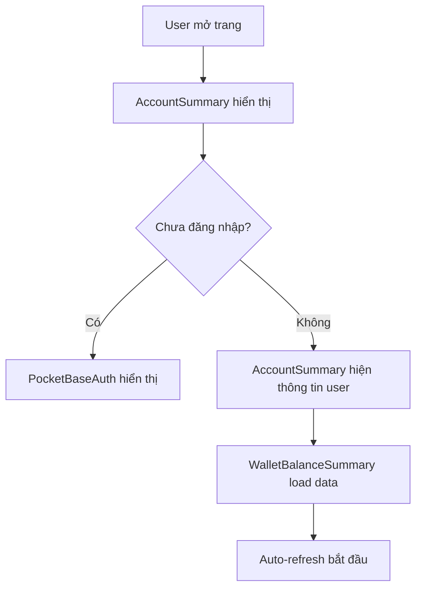
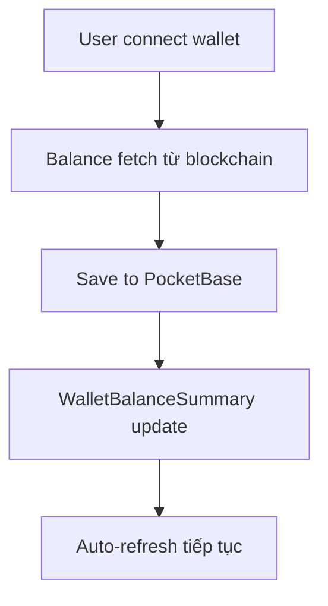

# Wallet System với PocketBase Integration

## Tổng quan

Hệ thống wallet đã được cải tiến với các tính năng sau:

1. **Authentication với PocketBase**: Đăng nhập/đăng ký user an toàn
2. **Wallet Portfolio Summary**: Hiển thị tổng quan số dư tất cả ví
3. **Account Management**: Quản lý thông tin tài khoản và thống kê
4. **Auto-sync**: Tự động đồng bộ dữ liệu giữa các thiết bị
5. **Multi-network Support**: Hỗ trợ Ethereum, Solana, và SUI

## Cấu trúc Components

### 1. AccountSummary.svelte
Hiển thị thông tin tài khoản và thống kê wallet của user.

**Tính năng:**
- Avatar và thông tin user
- Thống kê số wallet (total, connected)
- Quick actions (Create, Import, Settings)
- Authentication state management

**Sử dụng:**
```svelte
<AccountSummary />
```

### 2. WalletBalanceSummary.svelte
Hiển thị tổng quan số dư ví và portfolio của user.

**Tính năng:**
- Tổng số dư portfolio (USD)
- Breakdown theo network (ETH, SOL, SUI)
- Danh sách connected wallets
- Auto-refresh mỗi 30 giây
- Manual refresh option

**Sử dụng:**
```svelte
<WalletBalanceSummary />
```

## Cách hoạt động

### 1. Authentication Flow


### 2. Wallet Data Flow


### 3. Auto-refresh Mechanism
- Mỗi 30 giây: Refresh balance của connected wallets
- Khi user đăng nhập: Load wallet data và bắt đầu auto-refresh
- Khi user đăng xuất: Dừng auto-refresh và clear data
- Khi wallet connect: Trigger refresh để update UI

## Database Schema

### Users Collection
```javascript
{
  id: "string",
  email: "string",
  name: "string",
  created: "datetime",
  updated: "datetime"
}
```

### Wallets Collection
```javascript
{
  id: "string",
  user_id: "string", // Foreign key to users.id
  address: "string",
  private_key: "string (encrypted)", // Optional
  mnemonic: "string (encrypted)", // Optional
  wallet_type: "string", // metamask, phantom, generated, sui
  network: "string", // ethereum, solana, sui
  balance: "number",
  balance_last_updated: "datetime",
  is_connected: "boolean",
  notes: "string", // Optional
  created: "datetime",
  updated: "datetime"
}
```

## API Endpoints

### PocketBase Authentication
- `POST /api/collections/users/records` - Register user
- `POST /api/collections/users/auth-with-password` - Login user
- `POST /api/collections/users/auth-refresh` - Refresh token

### Wallet Operations
- `GET /api/collections/wallets/records` - Get user wallets
- `POST /api/collections/wallets/records` - Create wallet
- `PATCH /api/collections/wallets/records/:id` - Update wallet
- `DELETE /api/collections/wallets/records/:id` - Delete wallet

## Configuration

### Environment Variables
```env
VITE_POCKETBASE_URL=http://localhost:8090
VITE_USE_POCKETBASE_PROXY=false
```

### PocketBase Config
```typescript
// client/src/lib/config/pocketbase-config.ts
export const POCKETBASE_URL = 'http://localhost:8090';
export const COLLECTIONS = {
  WALLETS: 'wallets',
  USERS: 'users',
  TRANSACTIONS: 'transactions'
};
```

## Security Features

1. **Encrypted Storage**: Private keys và mnemonics được mã hóa trong database
2. **User Isolation**: Mỗi user chỉ thấy wallets của mình (qua user_id filter)
3. **Token-based Auth**: Sử dụng JWT tokens với expiration
4. **CORS Protection**: Proper CORS headers và origin validation

## Performance Optimizations

1. **Auto-refresh**: Chỉ refresh khi có connected wallets
2. **Event-driven Updates**: Sử dụng custom events thay vì polling
3. **Lazy Loading**: Components chỉ load khi cần thiết
4. **Caching**: PocketBase client có built-in caching

## Troubleshooting

### Common Issues

1. **Authentication Failed**
   - Kiểm tra PocketBase server đang chạy
   - Verify credentials
   - Check CORS settings

2. **Wallet Balance Not Updating**
   - Kiểm tra wallet connection
   - Verify RPC endpoints
   - Check network connectivity

3. **Auto-refresh Not Working**
   - Kiểm tra browser console logs
   - Verify user authentication state
   - Check for JavaScript errors

### Debug Mode
```javascript
// Enable debug logging
localStorage.setItem('debug', 'pocketbase:*');
```

## Future Enhancements

1. **Transaction History**: Track wallet transactions
2. **Price Alerts**: Notify when prices change
3. **Multi-currency Display**: Show balances in different currencies
4. **Export/Import**: Backup and restore wallet data
5. **2FA Support**: Additional security layer

## Support

Nếu gặp vấn đề, hãy kiểm tra:
1. Browser console logs
2. PocketBase admin panel
3. Network tab trong DevTools
4. Server logs

---

*Last updated: October 2025*


